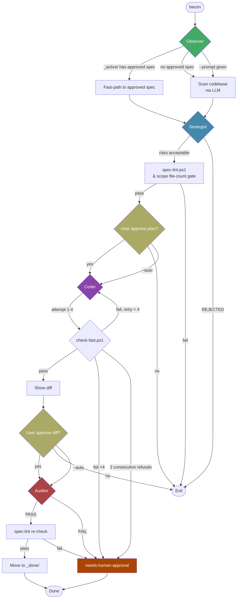

# Bacon Workflow

## Quick Start
- [Getting Started](#getting-started)
- [Basic Usage](#basic-usage)
- [Common Examples](#common-examples)

## Pipeline Details
- [Roles and Responsibilities](#roles)
- [Interactive Gates](#interactive-gates)
- [Error Recovery](#error-recovery)
- [Metrics and Observability](#metrics-and-observability)

## Configuration
- [bacon.toml Reference](#configuration-reference)
- [Agent Setup](#agent-setup)
- [Security Guidelines](#security-guidelines)
- [Monitoring](#monitoring)

## Advanced Topics
- [Custom Agents](#custom-agents)
- [Testing Integration](#testing-integration)
- [Troubleshooting](#troubleshooting)

## Reference
- [CLI Reference](#cli-reference)
- [File Formats](#file-formats)
- [Practical Examples](#practical-examples)

---

## Overview

A gated LLM pipeline that turns prompts into verified spec-driven changes. Each role validates the previous stage before proceeding. The spec filesystem is the source of truth — no global pipeline state.

## Pipeline



## Getting Started

### Prerequisites
- Rust toolchain (`cargo`, `rustc`)
- Git for version control
- NVIDIA API key in `.env` (see [NVIDIA Agent Configuration](#nvidia-agent-configuration))

### Installation
```bash
# Clone the repository
git clone <repository-url>
cd auto-rust

# Build Bacon
cargo build --release --bin bacon

# Build NVIDIA agent
cargo build --release --bin nvidia
```

### Two Operation Modes

| Mode | Command | Behavior | Use case |
|------|---------|----------|----------|
| **Spec creation** | `cargo run --bin bacon -p "..."` | Pauses at gates after Strategist & Coder. You review the plan before it gets automated. | Reviewing proposed changes before committing |
| **Full automation** | `cargo run --bin bacon --auto -p "..."` | Skips all gates. Observer → Strategist → Coder → Auditor in one pass. | 24/7 continuous improvement, CI |

### Basic Usage

Two core modes:

```bash
# MODE 1: Spec creation (interactive, recommended)
#   Pauses at gates for user review. Stops after spec is written.
#   Best for: reviewing plans before automation runs.
cargo run --bin bacon -p "refactor error handling"

# MODE 2: Full automation (unattended, 24/7)
#   Skips all confirmation gates. Observer → Strategist → Coder → Auditor.
#   Best for: continuous improvement, CI, overnight runs.
cargo run --bin bacon --auto -p "fix clippy warnings"
```

#### Other flags:

```bash
# Fast path for trivial fixes
bacon --fast -p "remove unused import"

# Dry run (no changes applied)
bacon --dry-run -p "improve documentation"

# Resume from specific stage
bacon --stage coder --spec 55
```

## Common Examples

### Example 1: Fix Clippy Warnings
```bash
bacon -p "fix all clippy warnings in src/utils/"
# Observer: Finds clippy warnings
# Strategist: Creates plan to fix warnings
# Coder: Implements fixes
# Auditor: Verifies warnings are gone
```

### Example 2: Refactor Common Pattern
```bash
bacon --fast -p "extract duplicate validation logic"
# Fast path: Skips strategist + auditor
# Direct from Observer to Coder
```

### Example 3: Batch Processing
```bash
# Process multiple improvements
for issue in "unused imports" "dead code" "long functions"; do
  bacon --auto -p "$issue"
done
```

## Fast Path (`--fast`)

Skips Strategist and Auditor — useful for trivial fixes where the full spec and audit are overkill.

```
bacon --fast -p "remove unused import"
  → Observer ──► Coder
  (skips Strategist + Auditor)
```

## Roles

| Role | Input | Output | Gate |
|------|-------|--------|------|
| Observer | prompt or `_active/` scan | problem description or approved spec path | `find_approved_spec()` fast-paths to first FIFO-approved spec |
| Strategist | observer output | spec package in `_active/` | `spec-lint.ps1` + `count_spec_file_refs()` (>3 files warns) |
| Coder | spec in `_active/` | code changes, status=`implemented` or `needs-human-approval` | `check-fast.ps1` temp worktree (max 4 attempts, 2 refusals → abort) |
| Auditor | implemented spec + patch file | `_done/` or `needs-human-approval` | approved patch content vs spec criteria; spec-lint re-check before archive |

## Interactive Gates

The pipeline pauses for user confirmation at two points. Skipped with `--auto` / `-y`.

| Gate | Prompt | Default | Auto |
|------|--------|---------|------|
| After Strategist | "Implement this plan? [Y/n]" | yes | skip |
| After Coder diff | "Apply this diff? [y/N]" | no | skip |

## Error Recovery

### Partial Work Recovery
- Coder crashes: `_active/<spec>/status: in-progress` marks incomplete work
- On restart, Bacon warns about incomplete specs
- User can run `bacon --stage coder --spec <NN>` to resume

### Network Failures
- External LLM providers: 3 retries with exponential backoff (1s, 2s, 4s)
- After 3 failures, fall back to local Ollama if configured
- Log failures to `sessions/<role>_errors.log`

### Timeout Handling
- LLM calls: 5-minute timeout per role
- Command execution: Job-specific timeouts from `bacon.toml`
- Timeouts trigger retry with simplified prompt
- After 3 timeouts, spec marked `needs-human-approval`

### Auto-Recovery
1. **Detection**: `check_stale_in_progress()` scans `_active/` for specs with `status: in-progress` on startup
2. **Auto-reset**: Specs stuck for >30 minutes are auto-reset to `approved` status and retried
3. **Notification**: Warnings logged for specs under 30-minute threshold
4. **Manual resume**: `bacon --stage <role> --spec <NN>`

### Error Logging
All errors are logged with context:
- `sessions/errors.json`: Structured error log (hidden from git)
- `sessions/<role>_stderr.log`: Role-specific stderr
- `sessions/crash_dump_<timestamp>.json`: Crash state dump

## Retry with Error Feedback

When `check-fast.ps1` fails, the Coder feeds stderr/stdout back to the LLM and retries (up to 4 total attempts). Key rules:

- **Repeated errors**: If the same error occurs on consecutive attempts, short-circuits to `needs-human-approval` immediately
- **Refusals**: 2 consecutive LLM refusals → abort pipeline, mark `needs-human-approval` (no scope reduction)
- **All 4 attempts fail**: Spec marked `needs-human-approval` (no scope reduction or Strategist re-call)
- **Worst-case cost**: 1 Observer + 1 Strategist + 4 Coder = 6 LLM calls max per failed spec

## Crash Recovery

On startup, `bacon` scans `_active/` for specs with `status: in-progress` (left by a Coder crash) and warns the user.

## Metrics and Observability

### Tracked Metrics
- **Pipeline success rate**: % of completed specs
- **Stage duration**: Time spent in each role
- **Retry count**: How often stages need retries
- **LLM token usage**: Cost tracking for external providers
- **Code impact**: Lines changed, files modified
- **Error rate**: Failures per stage
- **Queue depth**: Pending specs in `_active/`

### Monitoring Dashboard
Use `bacon-manager.ps1` for real-time monitoring:
```powershell
# System status with health score
.\bacon-manager.ps1 status

# View recent logs
.\bacon-manager.ps1 logs -Tail 100

# Show metrics summary
.\bacon-manager.ps1 metrics

# Test system health
.\bacon-manager.ps1 test
```

### Alert Configuration
Configure alerts in `bacon.toml`:
```toml
[monitoring.alerts]
success_rate_below = 80      # Alert if <80% success
avg_duration_above = 300     # Alert if >5 minutes per spec
error_rate_above = 20        # Alert if >20% error rate
queue_depth_above = 10       # Alert if >10 pending specs
memory_usage_above = 2048    # Alert if >2GB memory used
```

### Metrics Storage
- Real-time: `sessions/metrics.json` (rolling 24-hour window)
- Historical: `sessions/metrics_archive/` (daily archives)
- Dashboard: `sessions/dashboard.html` (HTML report via `bacon-manager.ps1 report`)

## Dry Run (`--dry-run`)

All roles check `ctx.dry_run` and skip filesystem writes. Pipeline runs, prints LLM output, but nothing is saved.

## Configuration Reference

### bacon.toml Structure

The autonomous pipeline reads from `.bacon/bacon.toml`. Only two sections have active code backing:

```toml
[pipeline]
# Agent routing for each pipeline stage.
# Values: "bacon" (NVIDIA, in-process) or another agent name
# read from [agents.<name>].command_args.
observer = "nvidia"
strategist = "nvidia"
coder = "nvidia"
auditor = "nvidia"

# Agent LLM configuration
# Supports: type, provider, model, temperature, command_args,
# api_key, base_url, top_p, max_tokens
[agents.observer]
type = "local"
provider = "ollama"
model = "llama3.2:3b"
temperature = 0.2

[agents.strategist]
type = "local"
provider = "ollama"
model = "llama3.2:3b"
temperature = 0.1

[agents.coder]
type = "local"
provider = "ollama"
model = "llama3.2:3b"
temperature = 0.3

[agents.auditor]
type = "local"
provider = "ollama"
model = "llama3.2:3b"
temperature = 0.1

# External agent workers
[agents.codex]
type = "external"
provider = "cli"
command_args = ["-p", "{prompt}", "--role", "{role}"]
```

> **Removed:** `[workflow]`, `[global]`, `[monitoring]`, `[safety]` sections and their ~29 keys were removed in Phase 2.1 — they had no corresponding Rust code backing.

> **Preserved but unrelated:** `[jobs.*]` sections serve the external `bacon` CI watcher tool, not the autonomous pipeline.

### Environment Variables
Use environment variables for sensitive configuration:
```toml
[agents.openai]
type = "external"
provider = "openai"
api_key = "{env:OPENAI_API_KEY}"  # Reference environment variable
model = "gpt-4"
```

### Configuration Precedence
1. Command line arguments (`--fast`, `--auto`, etc.)
2. Environment variables
3. `bacon.toml` configuration
4. Default values

## Agent Setup

### Agent Types
- **Local (in-process)**: Runs within Bacon process using configured LLM
- **External (CLI worker)**: Shells out to external command
- **Disabled**: Skips the role (useful for testing)

### Local Agent Configuration
```toml
[agents.observer]
type = "local"
provider = "ollama"   # ollama, openai, anthropic
model = "llama3.2:3b"
temperature = 0.2
timeout_seconds = 300
```

### External Worker Configuration
```toml
[agents.codex]
type = "external"
provider = "cli"
command_args = ["-p", "{prompt}", "--role", "{role}"]
timeout_seconds = 300
```

### Agent Routing
`bacon` is the supervisor. It uses the local Ollama-backed `bacon` roles by default, owns state, and gates all writes.

When agent type is `"external"`, `bacon` shells out to `{name} -p <prompt> --role <role>`.

Real CLI workers are enabled one role at a time after contract tests pass. The Observer role is the first enabled CLI worker.

## Security Guidelines

### API Key Management
- Store keys in `.env` file, not in `bacon.toml`
- Use environment variable references: `{env:OPENAI_API_KEY}`
- Rotate keys regularly via `bacon-manager.ps1 rotate-keys`
- Never commit `.env` files to version control

### Sensitive Code Review
Changes to security-sensitive areas trigger additional checks:
- **Paths**: `src/crypto/`, `src/auth/`, `src/network/`, `src/database/`
- **Requirements**:
  - Require manual Auditor approval (cannot use `--auto`)
  - Log to security audit trail (`sessions/security_audit.log`)
  - Run security scanner (`cargo audit`) automatically
  - Require 2 successful `check-fast.ps1` runs

### Rate Limiting
- External LLM providers: 10 requests/minute default
- Configurable per-provider in `bacon.toml`:
  ```toml
  [agents.openai.rate_limit]
  requests_per_minute = 10
  burst_size = 3
  ```
- Queue overflow: store in `sessions/pending/` for later processing

### Security Scanning
Enabled by default in `[safety]` section:
```toml
[safety]
security_scan_enabled = true
security_scan_paths = ["src/crypto/", "src/auth/", "src/network/"]
security_scan_commands = [
  "cargo audit",
  "cargo clippy -- -D security"
]
```

### Audit Trail
All security-relevant actions are logged:
- `sessions/security_audit.log`: Human-readable audit log
- `sessions/security_events.json`: Structured event log
- `sessions/approved_patches/`: Cryptographically signed approved patches

## Testing Integration

### Pre-commit Validation
- All specs run `check-fast.ps1` before Coder completion
- Failed tests trigger retry with test output as context
- After 3 retries, spec marked `needs-human-approval`

### Test Coverage Requirements
- **New features**: ≥80% test coverage required
- **Bug fixes**: Add regression test for fixed issue
- **Refactors**: Existing tests must pass unchanged
- **Performance changes**: Benchmark tests must not regress

### Continuous Testing
- `bacon test` runs contract tests for CLI workers
- `bacon test --fixture <name>` runs specific test suites
- Test results stored in `.bacon/test_runs/`
- Failed tests generate detailed reports in `test_runs/reports/`

### Test Command Configuration
Configure test commands in `bacon.toml`:
```toml
[testing]
unit_test_command = ["cargo", "test", "--lib"]
integration_test_command = ["cargo", "test", "--test", "*"]
benchmark_command = ["cargo", "bench"]
coverage_command = ["cargo", "tarpaulin", "--out", "Xml"]
min_coverage = 80  # Minimum test coverage percentage
```

### Test Failure Handling
1. **First failure**: Retry with test output as context
2. **Second failure**: Simplify change scope
3. **Third failure**: Mark as `needs-human-approval`
4. **Critical failure**: Rollback changes and alert

## CLI Worker Contract

External workers must print one JSON object to stdout and put logs on stderr:

```json
{
  "status": "ok",
  "description": "short handoff text for the next stage",
  "summary": "optional fallback handoff text",
  "spec_path": "docs/specs/_active/0001-example"
}
```

Rules:
- stdout must be valid JSON; plain text fails the stage.
- `status` values `error`, `fail`, `failed`, `reject`, and `rejected` stop the pipeline.
- `spec_path` is optional, but Strategist must provide it when it creates a spec for Coder.
- Workers should not write outside their role-owned paths; final apply still goes through approved patches and `check-fast.ps1`.

## Custom Agents

### Creating Custom Agents
1. **Implement the contract**: Output valid JSON to stdout
2. **Handle prompts**: Accept `-p <prompt> --role <role>` arguments
3. **Log to stderr**: All logs go to stderr for debugging
4. **Test**: Run `bacon test --fixture custom-agent` to verify

### Example Custom Agent (Python)
```python
#!/usr/bin/env python3
import json
import sys
import argparse

def main():
    parser = argparse.ArgumentParser()
    parser.add_argument("-p", "--prompt", required=True)
    parser.add_argument("--role", required=True)
    args = parser.parse_args()
    
    # Process based on role
    if args.role == "observer":
        result = {"status": "ok", "description": "Found improvement opportunity"}
    elif args.role == "strategist":
        result = {"status": "ok", "description": "Created plan", "spec_path": "docs/specs/_active/0001-example"}
    else:
        result = {"status": "ok", "description": f"Processed {args.role} stage"}
    
    # Output JSON to stdout
    print(json.dumps(result))
    
    # Log to stderr
    print(f"Processed {args.role} with prompt: {args.prompt[:50]}...", file=sys.stderr)

if __name__ == "__main__":
    main()
```

### Registering Custom Agents
Add to `bacon.toml`:
```toml
[agents.custom_python]
type = "external"
provider = "cli"
command_args = ["python", "custom_agent.py", "-p", "{prompt}", "--role", "{role}"]
timeout_seconds = 300
```

### Testing Custom Agents
```bash
# Test contract compliance
bacon test --fixture cli-worker-contract --agent custom_python

# Integration test
bacon test --fixture custom-agent-integration

# Performance test
bacon test --fixture performance --agent custom_python
```

## Agent LLM Config

`bacon.toml` `[agents.<name>]` configures local LLM or CLI command settings. Bacon must not require project API keys.

```toml
[agents.bacon]
provider = "ollama"
model = "llama3.2:3b"

[agents.kilocode]
provider = "cli"
command_args = ["run", "{prompt}", "--role", "{role}"]
```

These are read by `PipelineConfig::agent_llm_config()` and logged at runtime. Cloud providers are outside the default Bacon workflow.

## Troubleshooting

### Common Issues

#### "No clear improvement found"
- Run `cargo clippy` manually to see warnings
- Check `IMPROVEMENT_OPPORTUNITIES.md` for ideas
- Use specific prompt: `bacon -p "check src/api/ for dead code"`
- Increase Observer verbosity: `bacon -p "..." --log-level debug`

#### Pipeline stuck at "in-progress"
- Check `sessions/coder.log` for errors
- Run `bacon-manager.ps1 status` to see system health
- Manual resume: `bacon --stage coder --spec <NN>`
- Force cleanup: `bacon-manager.ps1 cleanup`

#### External LLM provider failing
- Verify API keys in `.env`
- Check network connectivity
- Test provider directly: `curl https://api.openai.com/v1/models`
- Fall back to local Ollama: set `provider = "ollama"` in `bacon.toml`

#### High memory usage
- Reduce concurrent jobs: `max_concurrent_jobs = 1` in `bacon.toml`
- Enable cleanup: `bacon-manager.ps1 cleanup`
- Monitor with: `bacon-manager.ps1 status`
- Restart: `bacon-manager.ps1 stop && bacon-manager.ps1 start`

#### Test failures during Coder stage
- Check `test_runs/test_results.log` for details
- Run `check-fast.ps1` manually to see errors
- Simplify scope: use `--fast` for trivial changes
- Review test output in `sessions/coder_stderr.log`

### Debug Mode
Enable detailed logging:
```bash
# Verbose logging
bacon -p "..." --log-level debug

# Save debug output
bacon -p "..." --log-level debug 2> debug.log

# Profile performance
bacon -p "..." --profile --profile-output profile.json
```

### Recovery Commands
```powershell
# System health check
.\bacon-manager.ps1 test

# View all logs
.\bacon-manager.ps1 logs

# Clean up old files
.\bacon-manager.ps1 cleanup

# Reset stuck pipeline
.\bacon-manager.ps1 stop
Remove-Item .bacon/sessions/orchestrate.pid -Force
.\bacon-manager.ps1 start
```

## 24/7 Continuous Operation

Run the pipeline in a loop for unattended, continuous improvement:

```powershell
# Simple loop — improves one thing per cycle
while ($true) {
    cargo run --bin bacon --auto -p "check for clippy warnings or small improvements"
    Start-Sleep -Seconds 60
}
```

The pipeline handles continuous operation safely:
- **No-op gracefully** — if nothing needs improvement, the pipeline finishes quickly
- **Crash recovery** — stale `in-progress` specs are detected on restart
- **No duplicate work** — the Observer skips LLM scan when approved specs are pending
- **Git-safe** — Coder validates changes in temp worktrees before applying

## CLI Reference

```bash
# Mode 1 — Spec creation (interactive)
bacon -p "refactor errors"     # guided pipeline, stops after spec

# Mode 2 — Full automation (unattended)
bacon --auto -p "fix warnings" # skips all gates, runs all 4 stages

# Other
bacon                          # full pipeline, auto-detect target
bacon --fast                   # skip strategist + auditor
bacon --dry-run                # sandbox mode (no writes)
bacon --stage coder --spec 55  # resume from a stage

# Testing
bacon test                     # run test harness
bacon test --list              # list test fixtures
bacon test --fixture clippy    # run one fixture

# Debugging
bacon --log-level debug        # verbose logging
bacon --profile                # performance profiling
bacon --trace                  # detailed trace logging

# Management
bacon --status                # show pipeline status
bacon --metrics               # show metrics dashboard
bacon --cleanup               # clean up old files
```

## File Formats

### Spec Package Structure
```
_active/<NN>-<name>/
    status: approved                 ← Strategist wrote it
    status: in-progress              ← Coder started (crash marker)
    status: implemented              ← Coder passed check-fast.ps1
    status: needs-human-approval     ← Coder retries exhausted or Auditor rejected

_done/<NN>-<name>/                   ← Auditor passed
_abandoned/<NN>-<name>/              ← Manually abandoned
```

### Spec File Contents
Each spec package contains:
- `spec.yaml` - Metadata (status, implementer, timestamp)
- `plan.md` - Full strategist plan
- `baseline.md` - Current state description
- `internal-api-outline.md` - API changes
- `validation.md` - Verification steps
- `notes.md` - Design decisions and risks
- `README.md` - Auto-generated summary
- `ci-commands.md` - CI/CD integration
- `quality-rules.md` - Quality requirements
- `validation-checklist.md` - Validation checklist
- `implementation-notes.md` - Coder implementation notes

### Log File Formats
- `sessions/*.log` - Plain text logs with timestamps
- `sessions/*.json` - Structured JSON logs
- `sessions/metrics.json` - Metrics in JSON Lines format
- `sessions/security_audit.log` - Security audit trail

### Configuration Files
- `bacon.toml` - TOML configuration
- `.env` - Environment variables (not committed)
- `.bacon/roles/*.md` - Role definitions

## Practical Examples

### Example 1: Automated Code Quality Improvement
```bash
# Run full pipeline on code quality issues
bacon --auto -p "improve code quality in src/utils/"

# Monitor progress
.\bacon-manager.ps1 status

# Check results
ls docs/specs/_done/
```

### Example 2: Security Vulnerability Fix
```bash
# Security fixes require manual approval
bacon -p "fix security vulnerability in auth module"

# Review plan before implementation
# [User approves plan]

# Review changes before audit
# [User approves changes]

# Security audit runs automatically
```

### Example 3: Performance Optimization
```bash
# Performance changes with benchmarks
bacon -p "optimize database query in src/database/"

# Check benchmark results
cargo bench -- --nocapture

# Verify no regressions
.\check.ps1
```

### Example 4: Documentation Update
```bash
# Fast path for documentation
bacon --fast -p "update API documentation in src/api/"

# Dry run first
bacon --dry-run -p "improve README.md"

# Batch update
bacon --auto -p "fix typos in documentation"
```

### Example 5: Test Coverage Improvement
```bash
# Target low coverage areas
bacon -p "add tests for src/utils/parser.rs"

# Check coverage
cargo tarpaulin --out Html

# Verify coverage improved
.\bacon-manager.ps1 metrics | Select-String "coverage"
```

### Example 6: Dependency Update
```bash
# Update dependencies safely
bacon -p "update serde to latest version"

# Test compatibility
cargo test --all-features

# Rollback if tests fail
# [Automatic rollback on failure]
```

## Agents

| Binary | Module | LLM | Role Prompts | Type |
|--------|--------|-----|:---:|:---:|
| `bacon` | `bacon_agent_pi` | Global config | ✅ built-in | Local |
| `codex` | `bacon_agent_codex` | Global config | ✅ `--role` | External |
| `gemini` | `bacon_agent_gemini` | Global config | ✅ `--role` | External |
| `opencode` | `bacon_agent_opencode` | Global config | ✅ `--role` | External |
| `kilocode` | `bacon_agent_kilocode` | Global config | ✅ `--role` | External |
| `ollama` | `bacon_agent_ollama` | Local Ollama | ✅ `--role` | External |
| `nvidia` | `bacon_agent_nvidia` | NVIDIA API | ✅ `--role` | External |

### NVIDIA Agent Configuration
The NVIDIA agent uses the NVIDIA AI API with OpenAI-compatible interface:

```toml
[agents.nvidia]
type = "external"
provider = "nvidia"
command_args = ["-p", "{prompt}", "--role", "{role}"]
timeout_seconds = 300
api_key = "{env:NVIDIA_API_KEY}"  # Use environment variable
base_url = "https://integrate.api.nvidia.com/v1"
model = "meta/llama-3.3-70b-instruct"
temperature = 1.0
top_p = 0.95
max_tokens = 8192
```

**Environment Setup:**
```bash
# Set NVIDIA API key from your NVIDIA AI account
export NVIDIA_API_KEY="nvapi-<your-key>"

# Test the agent
nvidia -p "test prompt" --role observer
```

### Agent Selection Priority
1. **Command line**: `--agent <name>` overrides configuration
2. **Configuration**: `bacon.toml` `[agents.<role>]` settings
3. **Default**: Local `bacon` agent with Ollama

### Agent Health Checks
Agents are monitored for:
- **Response time**: < 5 minutes per request
- **Success rate**: > 80% successful completions
- **Resource usage**: < 2GB memory per agent
- **Availability**: Respond within 30 seconds

Unhealthy agents are automatically disabled and logged.

---

## Summary

The Bacon workflow provides a robust, gated pipeline for autonomous code improvements with:

1. **Safety-first approach**: User gates, retry logic, and rollback
2. **Flexible configuration**: Multiple LLM providers and agent types
3. **Comprehensive monitoring**: Metrics, alerts, and dashboards
4. **Security integration**: Audit trails and security scanning
5. **Testing integration**: Continuous validation and coverage requirements
6. **Error recovery**: Crash recovery and partial work resumption

For support, check the troubleshooting guide or run `bacon-manager.ps1 test` to diagnose issues.
