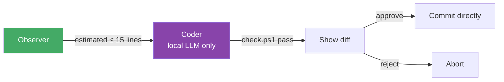

# Bacon Workflow

## Overview

A gated LLM pipeline that turns prompts into verified spec-driven changes. Each role validates the previous stage before proceeding. The spec filesystem is the source of truth — no global pipeline state.

## Pipeline

```mermaid
flowchart TD
    START([pi / pi \"prompt\"]) --> OBS{Observer}
    OBS -->|_active/ has pending spec| READ[Read spec package]
    OBS -->|empty _active/| SCAN[Scan codebase for<br/>small improvement]
    READ --> STRAT{Strategist}
    SCAN --> STRAT

    STRAT -->|risks acceptable| SHOW_PLAN[Show plan to user]
    STRAT -->|risks too high| OBS

    SHOW_PLAN -->|user approves| WRITE[Write spec package<br/>to _active/]
    SHOW_PLAN -->|user rejects| REJECTED[Explain why, exit]

    WRITE -->|spec-lint passes| CODER{Coder}
    WRITE -->|spec-lint fails<br/>retry ≤ 3| STRAT
    WRITE -->|spec-lint fails<br/>retry exhausted| HUMAN

    CODER -->|in-progress| IMPLEMENT[Edit source files,<br/>tests, docs]
    IMPLEMENT --> CHECK_RUN[Run check.ps1]
    CHECK_RUN -->|pass| SHOW_DIFF[Show diff to user]
    CHECK_RUN -->|fail + error feedback| CODER_RETRY[Retry ≤ 3]
    CODER_RETRY --> IMPLEMENT
    CHECK_RUN -->|fail + retry exhausted| HUMAN

    SHOW_DIFF -->|user approves| AUDITOR{Auditor}
    SHOW_DIFF -->|user rejects| FIX[Request changes → Coder]

    AUDITOR -->|semantic review pass| DONE[Status=done<br/>move to _done/]
    AUDITOR -->|semantic review fail| HUMAN

    DONE --> END([Done])
    HUMAN --> END([Status=needs-human-approval])

    style OBS fill:#4a6,color:#fff
    style STRAT fill:#48a,color:#fff
    style CODER fill:#84a,color:#fff
    style AUDITOR fill:#a44,color:#fff
    style HUMAN fill:#a40,color:#fff
```

## Fast Path (Trivial Fixes)

For cheap, mechanical changes the pipeline short-circuits to save cost and latency.



**Trigger conditions** (all must be true):
- Estimated change ≤ 15 lines across ≤ 2 files
- Only touches existing code (no new files)
- Mechanical transformation only (rename, dead code removal, clippy lint)
- Observer confidence ≥ 8/10

## Roles

| Role | Input | Output | Gate |
|------|-------|--------|------|
| Observer | prompt or `_active/` scan | problem description or spec reference | must find a valid target |
| Strategist | observer output | spec package in `_active/` | confirm approach + risk + pass spec-lint |
| Coder | approved spec in `_active/` | code changes, status=`implemented` | pass `check.ps1` |
| Auditor | implemented spec | status=`done` → `_done/`, or `needs-human-approval` | pass semantic review |

### Observer

Scans `_active/` for the earliest spec in `approved` status. If none found, analyzes the codebase for a small improvement.

**Context needed**: `_active/` directory listing, `spec.yaml` of each pending spec, codebase structure (top-level dirs + key files).

**Fallback scope boundary**: max 30 lines changed, 3 files, no new dependencies, no API changes. If the problem exceeds this, stop and report "too large for automatic pipeline."

### Strategist

Validates the observer's output. If the approach is sound and risks are acceptable, shows the plan to the user for approval, then writes a complete spec package to `_active/`.

**Spec numbering**: auto-increment from the highest NN across both `_active/` and `_done/`. The LLM does not pick the number.

**Spec package** follows the project template at `docs/specs/_template/`:
- `spec.yaml` — status: `approved`, implementer: `pipeline`
- `plan.md` — step-by-step implementation plan
- `baseline.md` — current state description
- `internal-api-outline.md` — API changes if any
- `validation.md` — how to verify
- `notes.md` — design decisions, risks

**Gate**: must run `spec-lint.ps1` on the written package before accepting. If it fails, fix and retry (max 3 attempts), then escalate to `needs-human-approval`.

### Coder

Reads the spec from `_active/`, sets status to `in-progress` (crash recovery marker), then implements by editing source files, tests, and docs.

**Retry with feedback**: when `check.ps1` fails, the error output is fed back into the LLM prompt for the next attempt. This gives the model concrete errors to fix rather than guessing blindly (max 3 attempts).

**Context needed**: full spec package, relevant source files (read before writing), `check.ps1` integration, error output from failed runs.

**After implementation**: shows the diff to the user for manual approval, then updates spec status to `implemented`.

### Auditor

Reviews the implemented spec. The auditor does **not** re-run `check.ps1` — the Coder already did. Instead the auditor evaluates:

- **Correctness**: does the implementation match the spec?
- **Completeness**: are all acceptance criteria met?
- **Edge cases**: did the Coder miss anything?
- **Safety**: no regressions introduced?
- **Style**: does it follow project conventions?

**Context needed**: the spec package, the implemented code (git diff), `check.ps1` pass confirmation.

**PASS** → set `status: done`, move package directory from `_active/` to `_done/`.

**FAIL** → set `status: needs-human-approval` in `spec.yaml`, write an audit report to `validation.md`, keep in `_active/`.

## LLM Routing

| Role | Primary | Fallback | Reason |
|------|---------|----------|--------|
| Observer | local (Ollama) | cloud (OpenRouter) | fast scans, cheap |
| Strategist | cloud (OpenRouter) | local (Ollama) | domain reasoning |
| Coder | cloud (OpenRouter) | local (Ollama) | code quality |
| Auditor | both, cross-validate | — | two independent reviews |

**Fast path** (≤ 15 line mechanical fixes): local LLM only, skip cloud calls entirely.

## Interactive Gates

Before irreversible actions, the pipeline pauses for user confirmation. These can be skipped with `--auto` / `--yes` for headless runs.

| Gate | Prompt | Default |
|------|--------|---------|
| After Strategist | "Implement plan `<title>`? [`plan.md` summary]" | y |
| After Coder diff | "Apply this diff? [`git diff --stat`]" | n |
| Before parallel batch | "Process N specs in parallel?" | y (non-overlapping files only) |

## CLI

```bash
pi                          # full pipeline
pi "review error handling"  # guided pipeline with prompt
pi --stage coder --spec 55  # resume from a specific stage
pi --fast                   # force fast path
pi --dry-run                # run in sandbox, don't touch real files
pi --auto                   # skip all interactive gates
pi --parallel               # process independent specs in parallel
```

## File State Machine

```
_active/<NN>-<name>/
    status: approved                 ← Strategist (pass)
    status: in-progress              ← Coder started (crash recovery marker)
    status: implemented              ← Coder (pass + user approved)
    status: needs-human-approval     ← Coder (3 retries failed) or Auditor (fail)

_done/<NN>-<name>/                   ← Auditor (pass), status: done
```

## Failure Modes

| Failure | Handling |
|---------|----------|
| Observer finds nothing | Report "no target found", exit |
| Strategist rejects risks | Report reason, exit. User can retry with more specific prompt |
| Strategist fails spec-lint | Retry with fix feedback up to 3 times, then escalate |
| Coder crashes mid-implementation | Status is `in-progress`. Next run detects stale `in-progress` > 1 hour → warn + ask "retry or abandon?" |
| Coder fails check.ps1 | Feed error output back to LLM, retry up to 3 times |
| Auditor fails semantic check | Set `needs-human-approval`, write audit report, exit |
| LLM unavailable | Fallback to alternative provider. If both down, report and exit |

## Context Access Per Role

| Role | Read | Write |
|------|------|-------|
| Observer | `_active/`, codebase structure | stdout (description) |
| Strategist | problem description, source files, spec template | `_active/<NN>-<name>/` spec package |
| Coder | spec package, source files | source files, `_active/<NN>-<name>/spec.yaml` (status) |
| Auditor | spec package, source files (git diff) | `_active/<NN>-<name>/spec.yaml` (status), `_done/` |

No role writes outside its defined scope. Coder never writes to `spec.yaml` fields it doesn't own.

## Crash Recovery

The `in-progress` status acts as a crash marker:

1. On startup, scan for specs with `status: in-progress`
2. Check age: if < 1 hour, resume (the LLM session may still be fresh)
3. If > 1 hour, warn the user and suggest manual review

The Coder stores intermediate context (files modified, last check.ps1 output) in a `.bacon/sessions/coder_<NN>/` directory for recovery.

## Parallel Execution

When Observer returns multiple independent issues, specs that touch non-overlapping files can be processed in parallel:

```
Observer finds issues A, B, C (different modules)
    → Strategist(A), Strategist(B), Strategist(C) ── parallel
    → Coder(A), Coder(B), Coder(C) ── parallel
    → Auditor(A), Auditor(B), Auditor(C) ── parallel
```

File overlap is determined by the `files.code` list in each `spec.yaml`.

## Dry Run Mode (`--dry-run`)

```
Observer → reads real codebase
Strategist → writes spec to .bacon/sessions/dryrun/
Coder → creates git worktree, implements in sandbox
Auditor → reviews sandbox
Nothing touches real _active/, _done/, or source files.
```

Useful for testing the pipeline or evaluating proposed changes before committing.

## Test Harness (`bacon test`)

A self-contained test suite that validates the pipeline against a throwaway repo with known issues.

### How it works

1. Create a temporary git repo from a fixture template (small Rust project with seeded bugs)
2. Run the pipeline against it (`pi --dry-run` or direct role invocations)
3. Assert expected outputs: spec was written, code was changed, audit passed/failed as expected
4. Destroy the temp repo

### Fixture templates

Stored in `.bacon/fixtures/`:

| Fixture | Description | Expected |
|---------|-------------|----------|
| `trivial-dead-code` | One unused function | Fast path, Coder removes it |
| `clippy-lints` | 3 clippy warnings of different types | Strategist creates spec, Coder fixes all |
| `risky-change` | Change that modifies fingerprinting code | Auditor rejects → `needs-human-approval` |
| `spec-already-done` | `_active/` already empty, `_done/` has everything | Observer finds nothing, exits cleanly |

Each fixture has:
- A `repo/` directory (the git repo state before the pipeline runs)
- A `_active/` and `_done/` directory (what the pipeline sees)
- An `expect/` directory (expected output state after the pipeline)
- A `fixture.yaml` describing what the pipeline should do

### What it validates

- Each role produces correct output for known inputs
- Gate transitions work (approve → reject, fail → escalate)
- Crash recovery (simulated mid-pipeline kill)
- Fast path triggers correctly for trivial fixes
- Dry-run mode produces identical decisions but writes nothing real
- Spec-lint validation gates work

### CLI

```bash
bacon test                    # run all fixtures
bacon test --fixture clippy   # run one fixture
bacon test --list             # list available fixtures
bacon test --update           # regenerate fixture expectations from current behavior
```

### Running alongside check.ps1

`bacon test` is independent of `check.ps1` (which validates the auto-rust codebase itself). Both should pass before committing changes to the pipeline code or prompts.
