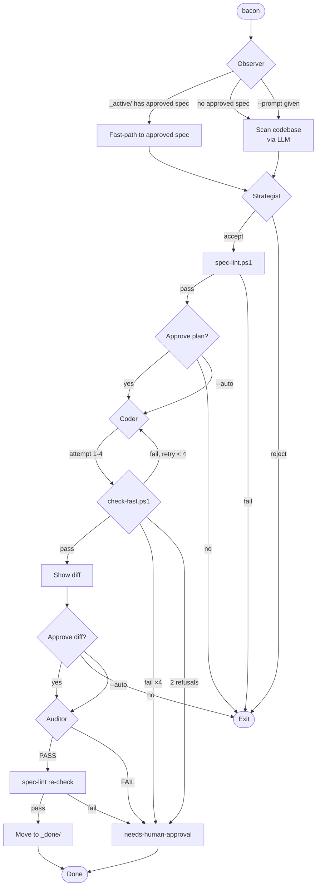

# Bacon Pipeline — Technical Reference

*last audited 18-05-26 by Codex*

## Pipeline Overview

Bacon runs a 4-stage gated LLM pipeline that turns prompts into verified code changes. Each stage validates the previous stage before proceeding. The spec filesystem is the source of truth — no global pipeline state.



## Pipeline Stages

| Stage | Input | Output | Gate |
|-------|-------|--------|------|
| **Observer** | Prompt or `_active/` scan | Problem description or approved spec path | `find_approved_spec()` fast-paths to first FIFO-approved spec |
| **Strategist** | Observer output | Spec package in `_active/` | `spec-lint.ps1` + `count_spec_file_refs()` (>3 repo file refs warns); plans must be grounded in verified source text |
| **Coder** | Spec in `_active/` | Code changes, status=`implemented` or `needs-human-approval` | `check-fast.ps1` on the working tree with GitSnapshot rollback (max 4 attempts, 2 refusals → abort) |
| **Auditor** | Implemented spec + patch | `_done/` or `needs-human-approval` | Approved patch content vs spec criteria; spec-lint re-check before archive |

## Interactive Gates

Pipeline pauses for user confirmation at two points. Skipped with `--auto` / `-y`.

| Gate | Prompt | Default | Auto |
|------|--------|---------|------|
| After Strategist | "Implement this plan? [Y/n]" | yes | skip |
| After Coder diff | "Apply this diff? [y/N]" | no | skip |

## Spec Package

Each spec lives in `docs/specs/_active/<NNNN>-<slug>/` and contains 3 files:

| File | Contents | Written by |
|------|----------|-----------|
| `spec.yaml` | Metadata (status, implementer, timestamp, doc refs) | Strategist / Coder / Auditor |
| `plan.md` | Step-by-step implementation plan | Strategist |
| `validation.md` | Acceptance criteria and verification steps | Strategist |

**Status lifecycle:** `approved` → `in-progress` → `implemented` → (move to `_done/`)

**Special status:** `needs-human-approval` — set when Coder retries exhausted or Auditor rejects.

## Configuration

### bacon.toml

The pipeline reads `.bacon/bacon.toml`. Only `[pipeline]` and `[agents.*]` have active code backing:

```toml
[pipeline]
observer = "nvidia"
strategist = "nvidia"
coder = "bacon"
auditor = "bacon"
stage_delay_ms = 500        # Pause in ms between stages

[agents.nvidia]
type = "external"
provider = "nvidia"
command_args = ["-p", "{prompt}", "--role", "{role}"]
api_key = "{env:NVIDIA_API_KEY}"
base_url = "https://integrate.api.nvidia.com/v1"
model = "meta/llama-3.3-70b-instruct"
temperature = 0.3
top_p = 0.95
max_tokens = 16384
```

### CLI Reference

```bash
# Mode 1 — Spec creation (interactive, recommended)
bacon -p "refactor error handling"

# Mode 2 — Full automation (unattended)
bacon --auto -p "fix clippy warnings"

# Fast path — skip Strategist + Auditor
bacon --fast -p "remove unused import"

# Other flags
bacon                          # auto-detect target
bacon --dry-run                # sandbox mode (no writes)
bacon --auto-apply             # apply verified patches without confirmation
bacon --parallel               # process independent specs in parallel
bacon --stage coder --spec 55  # resume from a stage

# Testing
bacon test                     # run test harness
bacon test --list              # list test fixtures
bacon test --fixture clippy    # run one fixture
```

### Environment Variables

| Variable | Purpose |
|----------|---------|
| `NVIDIA_API_KEY` | NVIDIA AI API key (required for nvidia agent) |
| `NVIDIA_MODEL` | Overrides the NVIDIA model name |
| `NVIDIA_BASE_URL` | Overrides the NVIDIA API base URL |
| `NVIDIA_TEMPERATURE` | Overrides generation temperature |
| `NVIDIA_TOP_P` | Overrides nucleus sampling |
| `NVIDIA_MAX_TOKENS` | Overrides output token limit |
| `RUST_LOG` | Log level (debug, info, warn, error) |

Model precedence: `NVIDIA_MODEL` env > `.bacon/bacon.toml [agents.nvidia].model` > built-in `meta/llama-3.3-70b-instruct`.

## Error Recovery

### Retry with Error Feedback

When `check-fast.ps1` fails, the Coder feeds stderr/stdout back to the LLM and retries (up to 4 attempts):

- **Repeated errors**: Same error on consecutive attempts → short-circuit to `needs-human-approval`
- **Refusals**: 2 consecutive LLM refusals → abort, mark `needs-human-approval`
- **All 4 attempts fail**: Mark `needs-human-approval`
- **Worst-case cost**: 1 Observer + 1 Strategist + 4 Coder = 6 LLM calls per failed spec

### Crash Recovery

On startup, `check_stale_in_progress()` scans `_active/` for specs with `status: in-progress`. Specs stuck >30 minutes are auto-reset to `approved` and retried. Specs under the threshold are warned.

### Manual Resume

```bash
bacon --stage <role> --spec <NN>
```

## CLI Worker Contract

External workers must print one JSON object to stdout; logs go to stderr.

```json
{
  "status": "ok",
  "description": "short handoff text for next stage",
  "summary": "optional fallback handoff text",
  "spec_path": "docs/specs/_active/0001-example"
}
```

- stdout must contain a `WorkerOutput` JSON object; the runtime extracts the first balanced JSON object, so log prefixes are tolerated but plain text still fails.
- `status` values `error`, `fail`, `failed`, `reject`, `rejected` stop the pipeline.
- `spec_path` is optional; Strategist must provide it when creating a spec for Coder.

## Security Guidelines

- Store API keys in `.env` file, not in `bacon.toml`
- Use environment variable references: `{env:NVIDIA_API_KEY}`
- Never commit `.env` files to version control
- Security-sensitive paths (`src/crypto/`, `src/auth/`) require manual Auditor approval

## Metrics

Aggregate pipeline metrics are logged through the `log` crate (info level) during execution and are visible in the terminal output:

- Pipeline success rate
- Stage duration
- Retry count
- LLM token usage
- Code impact (lines changed, files modified)
- Error rate per stage

*Note: Detailed per-run metric persistence is tracked via the broader framework's metrics system in `src/metrics.rs`.*

## Development

### Validation Scripts

| Script | Purpose |
|--------|---------|
| `check-fast.ps1` | Quick validation: cargo check, clippy, fmt |
| `check.ps1` | Full validation: slow tests, integration tests |
| `spec-lint.ps1` | Spec package quality check |
| `spec-stash.ps1` | Checkpoint worktree before spec handoffs |
| `spec-restore.ps1` | Restore from named checkpoint |

### Tests

```bash
cargo nextest run              # run all tests
cargo nextest run <test_name>  # run specific test
bacon test                     # run pipeline test harness
```
